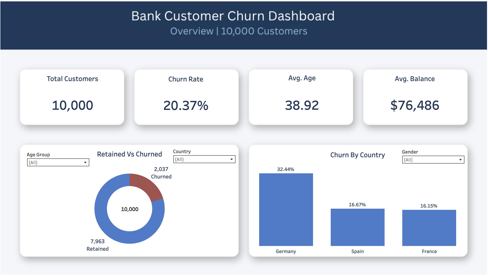
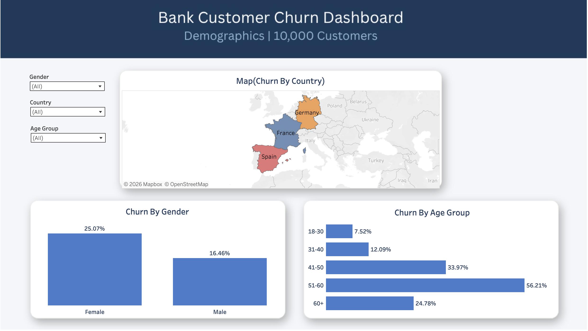
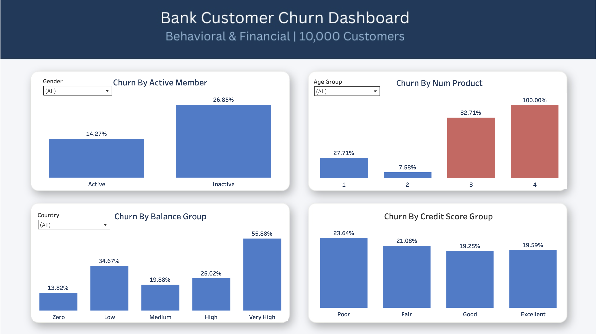

# 🏦 Bank Customer Churn Analysis

An end-to-end Data Analytics project covering data cleaning, 
exploratory data analysis, and interactive dashboard development 
on the Bank Customer Churn dataset.



---

## 📌 Project Overview

This project analyzes **10,000 bank customer records** to identify 
the key drivers of customer churn and provide actionable 
recommendations to improve retention.

| Detail | Info |
|--------|------|
| Dataset | [Bank Customer Churn Dataset (Kaggle)](https://www.kaggle.com/datasets/gauravtopre/bank-customer-churn-dataset) |
| Records | 10,000 customers |
| Features | 12 columns |
| Churn Rate | 20.4% |

---

## 🛠️ Tools & Technologies

| Tool | Purpose |
|------|---------|
| Python (Pandas, Seaborn, Matplotlib) | Data cleaning, EDA & Visualization |
| Tableau Public | Interactive Dashboard |
| Microsoft Word | Formal Report |
| SQL | Exploratory Data Analysis |

---

## 🧹 Data Cleaning Process

| Step | Action | Result |
|------|--------|--------|
| Missing Values | Checked all columns | No missing values found |
| Duplicates | Checked all rows | No duplicates found |
| Column Removal | Dropped customer_id | Not required for analysis |
| Label Mapping | churn, credit_card, active_member → labels | Human readable |
| Binning | age → age_group, balance → balance_group, credit_score → credit_score_group | Grouped for analysis |

---

## 📊 Key Findings & Insights

### 🔴 Churn Overview
- **Overall Churn Rate:** 20.4% — 1 in 5 customers is leaving
- **Germany** has the highest churn rate **(32.4%)** — nearly double France & Spain
- **Female customers** churn significantly more **(25.1% vs 16.5%)**

### 👤 Demographics Analysis
- Customers aged **51-60 have the highest churn rate (56.2%)**
- Younger customers **(18-30)** are the most loyal **(7.5% churn)**
- Age is the **strongest predictor** of churn (correlation: 0.29)

### 💳 Behavioral Analysis
- **Inactive members** churn nearly twice as much **(26.9% vs 14.3%)**
- Customers with **2 products** are the most loyal **(7.6% churn)**
- **Credit score and salary** have minimal impact on churn

---

## 📋 Interactive Dashboard

### Dashboard 1 — Overview


### Dashboard 2 — Customer Demographics


### Dashboard 3 — Behavioral & Financial Analysis


🔗 **[View Live Dashboard on Tableau Public](https://public.tableau.com/app/profile/mehedi.hasan2176/viz/BankCustomerChurnAnalysis_17776499621410/Dashboard2)**

---

## 💡 Business Recommendations

1. **German Market** — Investigate why churn is significantly higher 
   and offer targeted incentives
2. **Female Customers** — Design personalized retention programs 
   and improve customer service experience
3. **Older Customers (41-60)** — Introduce loyalty programs, 
   premium services, or dedicated relationship managers
4. **Inactive Members** — Re-engage through email campaigns 
   and exclusive offers before they churn
5. **Product Cross-selling** — Encourage customers to adopt a 
   second product — 2-product customers churn the least

---

## 📂 Project Structure

```
bank-customer-churn-analysis/
├── images/
│   ├── dashboard_1.png
│   ├── dashboard_2.png
│   └── dashboard_3.png
├── notebook/
│   ├── bank_churn_cleaning.ipynb
│   └── bank_churn_eda.ipynb
├── report/
│   └── Bank_Customer_Churn_Analysis.pdf
├── bank_churn_cleaned.csv
└── README.md
```

---

## 👤 Author

**Mehedi Hasan**

[](https://www.linkedin.com/in/mehedi-hasan-094855388/)
[](https://github.com/mehedi-hasan00)
[](https://public.tableau.com/app/profile/mehedi.hasan2176)
[](https://www.kaggle.com/mehedi71)